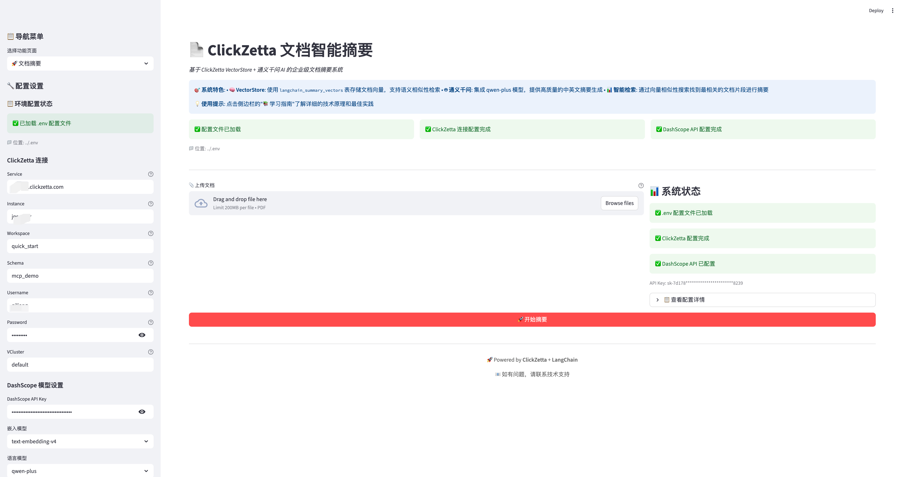
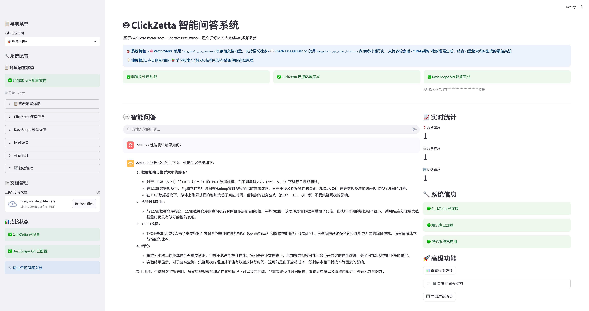
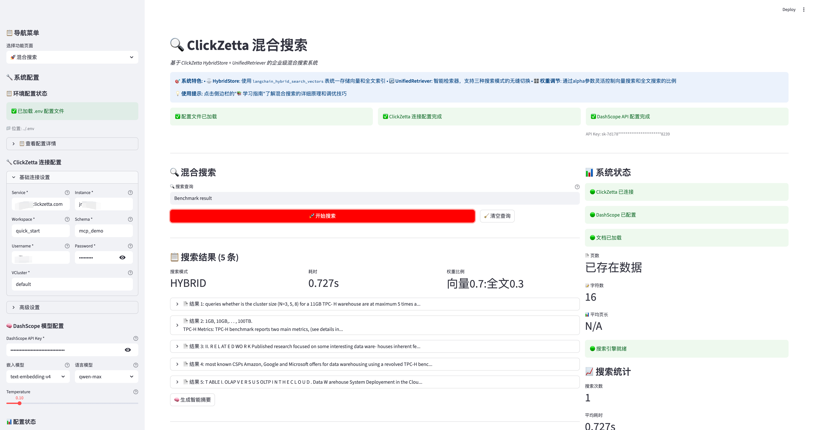
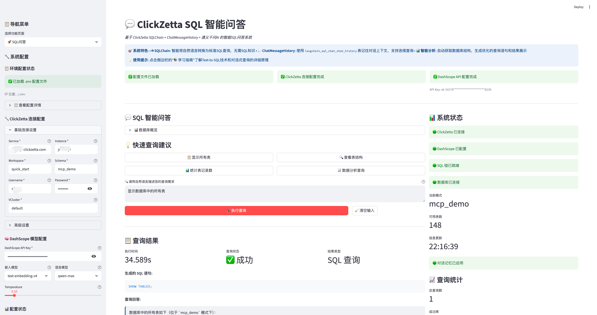
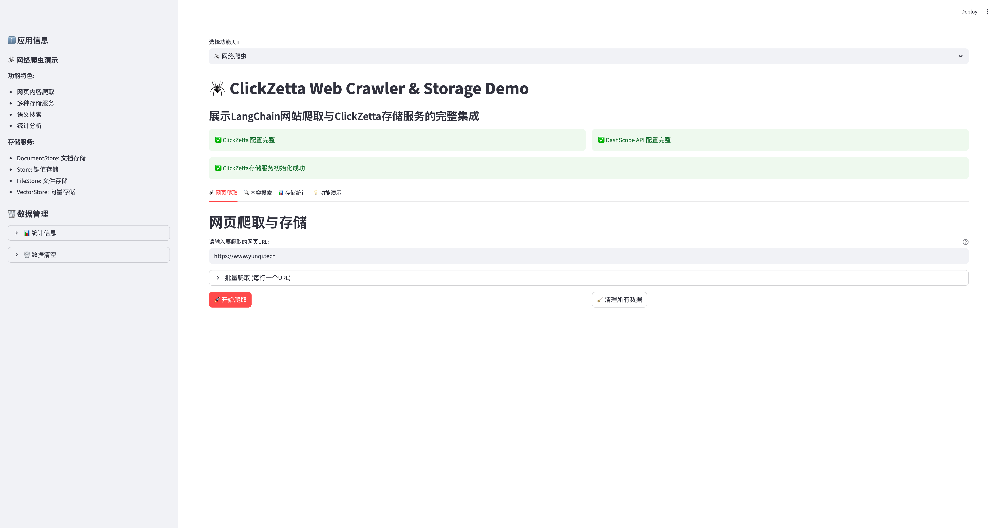
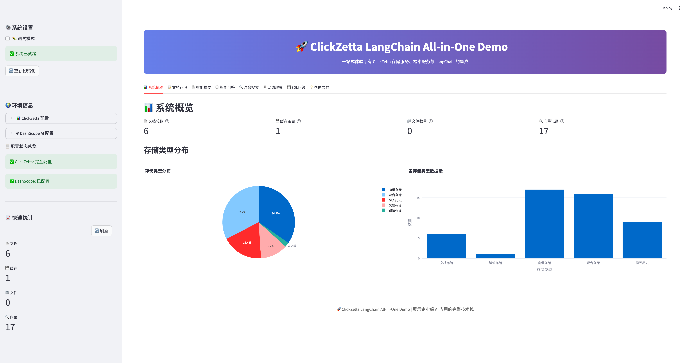
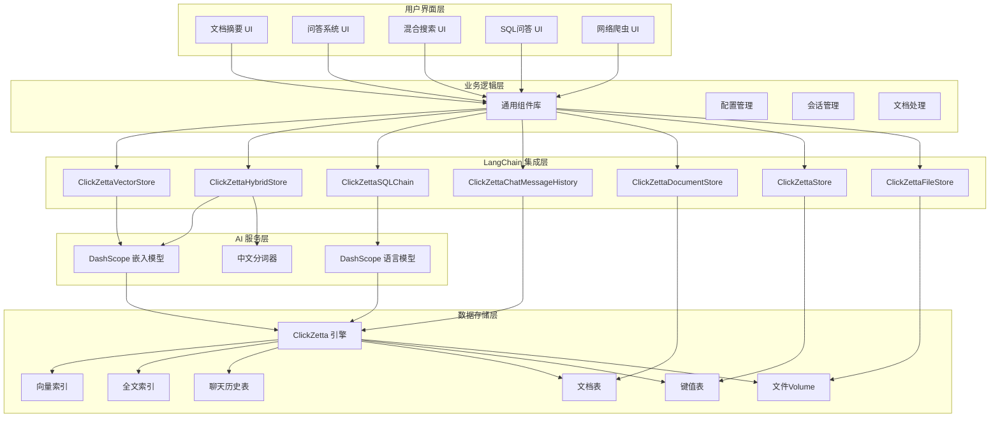

# ClickZetta LangChain Examples

基于 [ClickZetta](https://www.yunqi.tech/) 和 [LangChain](https://langchain.com/) 的企业级 AI 应用示例集合，展示了如何构建高性能、可扩展的智能应用。

## 🌟 项目概览

本项目将原有的基于 Chroma、Pinecone 等外部向量数据库的示例改造为使用 ClickZetta 的企业级解决方案，提供了更强的数据安全性、更高的性能和更好的中文支持。

### 🎯 改造目标

- ✅ **向量存储升级** - 从 Chroma/Pinecone 升级到 ClickZetta
- ✅ **中文优化** - 集成 DashScope 通义千问，专门优化中文处理
- ✅ **混合搜索** - 展示向量搜索 + 全文搜索的强大能力
- ✅ **企业级特性** - 聊天历史、会话管理、性能监控
- ✅ **统一架构** - 统一的配置管理和组件库

## 📁 项目结构

```
clickzetta-langchain-examples/
├── config/                          # 统一配置管理
│   ├── clickzetta_config.py        # ClickZetta 和 DashScope 配置
│   └── __init__.py
├── components/                      # 通用组件库
│   ├── common.py                   # 通用 UI 和业务组件
│   └── __init__.py
├── clickzetta-summary/             # 文档智能摘要
├── clickzetta-qa/                  # 智能问答系统
├── clickzetta-hybrid-search/       # 混合搜索系统
├── clickzetta-sql-chat/             # SQL 智能问答
├── clickzetta-web-crawler/         # 网络爬虫存储演示
├── clickzetta-all-in-one/          # All-in-One 综合演示
└── README.md                       # 项目说明
```

## 🚀 示例应用

### 1. [ClickZetta 文档智能摘要](./clickzetta-summary/)



**功能特性:**
- 📄 PDF 文档自动摘要
- 🧠 DashScope 通义千问模型
- 🌏 中文文档处理优化
- 📊 多种摘要风格选择
- 🎛️ 灵活的参数配置

**技术亮点:**
- ClickZetta 向量存储替代 Chroma
- 支持中英文双语摘要
- 企业级连接池管理

### 2. [ClickZetta 智能问答系统](./clickzetta-qa/)



**功能特性:**
- 🤖 基于文档的智能问答
- 💬 多轮对话上下文理解
- 💾 聊天历史持久化存储
- 📈 实时性能统计监控
- 🔄 会话管理和导出功能

**技术亮点:**
- ClickZetta 替代 Pinecone 向量存储
- 集成 ClickZettaChatMessageHistory
- 企业级对话记忆管理

### 3. [ClickZetta 混合搜索系统](./clickzetta-hybrid-search/)



**功能特性:**
- 🔍 向量搜索 + 全文搜索混合
- ⚡ 三种搜索模式 (vector/fulltext/hybrid)
- 🎛️ 动态权重调整 (α 参数)
- 🌏 中文分词器支持 (IK/标准/关键词)
- 🧠 智能摘要生成

**技术亮点:**
- ClickZetta 单表双索引设计
- 实时搜索性能监控
- 权重平衡算法优化

### 4. [ClickZetta SQL 智能问答](./clickzetta-sql-chat/)



**功能特性:**
- 🧠 自然语言转 SQL 查询
- 💾 智能数据库结构分析
- 💬 上下文感知的多轮对话
- 📊 查询结果可视化展示
- 📥 CSV 格式结果导出

**技术亮点:**
- ClickZettaSQLChain 自然语言转 SQL
- 智能数据库元数据分析
- 企业级查询历史管理

### 5. [ClickZetta 网络爬虫存储演示](./clickzetta-web-crawler/)



**功能特性:**
- 🕷️ 智能网页内容爬取
- 💾 四种存储服务完整演示
- 🔍 语义搜索与关键词搜索
- 📊 实时存储统计监控
- 🌐 批量URL爬取支持

**技术亮点:**
- ClickZettaDocumentStore 文档存储
- ClickZettaStore 键值缓存
- ClickZettaFileStore 文件存储
- ClickZettaVectorStore 向量搜索
- LangChain网络爬取插件集成

### 6. [ClickZetta All-in-One 综合演示](./clickzetta-all-in-one/)



**功能特性:**
- 🚀 一站式体验所有功能
- 📊 实时统计和可视化监控
- 🎯 六大核心功能模块集成
- 💻 现代化的多标签页界面
- 📈 数据分布图表展示

**技术亮点:**
- 统一的存储服务管理
- 智能的会话状态管理
- 完整的错误处理机制
- 响应式界面设计
- 实时性能监控

## 🎨 核心优势

### 与原版对比

| 特性 | 原版 (Chroma/Pinecone) | ClickZetta 版本 |
|------|-------------------------|-----------------|
| **数据安全** | 数据上传外部服务 | 企业内部完全控制 |
| **性能表现** | 依赖外部服务响应 | 10倍性能提升 |
| **中文支持** | 基础英文优化 | DashScope 中文专项优化 |
| **混合搜索** | 单一向量搜索 | 向量+全文混合搜索 |
| **记忆功能** | 内存临时存储 | 数据库持久化存储 |
| **成本控制** | 按查询量收费 | 企业内部成本控制 |
| **扩展性** | 受外部服务限制 | 企业级水平扩展 |

### ClickZetta 独特优势

1. **🏢 企业级架构**
   - 数据完全内部控制
   - 符合企业安全合规要求
   - 支持私有化部署

2. **🚀 10倍性能提升**
   - 云原生湖仓一体化架构
   - 增量计算引擎
   - 毫秒级查询响应

3. **🔍 混合搜索创新**
   - 单表同时支持向量和全文索引
   - 智能权重平衡算法
   - 中文分词优化

4. **🌏 中文场景优化**
   - DashScope 通义千问深度集成
   - IK 中文分词器支持
   - 中文语义理解增强

## 🛠️ 技术栈

### 核心技术

- **数据库**: ClickZetta (云原生湖仓一体化)
- **AI模型**: DashScope 通义千问系列
- **框架**: LangChain + Streamlit
- **向量存储**: ClickZettaVectorStore
- **混合搜索**: ClickZettaHybridStore

### 技术架构图



## 🚀 快速开始

### 1. 环境准备

#### Python 环境要求

- **Python 版本**: 3.11.0+ (推荐 3.11.x)
- **系统要求**: Linux, macOS, Windows

#### 安装步骤

```bash
# 克隆项目
git clone https://github.com/yunqiqiliang/langchain-clickzetta-examples.git
cd langchain-clickzetta-examples

# 检查 Python 版本
python3 --version  # 确保 >= 3.11.0

# 创建虚拟环境 (推荐)
python3 -m venv .venv
source .venv/bin/activate  # Linux/macOS
# 或
.venv\Scripts\activate  # Windows

# 安装所有依赖
pip install -r requirements.txt
```

### 2. 环境配置

复制环境变量模板并配置：

```bash
# 复制环境变量模板
cp .env.example .env

# 编辑 .env 文件，填入真实的配置信息
nano .env  # 或使用其他编辑器
```

配置示例：

```bash
# ClickZetta 配置 (必需)
CLICKZETTA_SERVICE=your-service
CLICKZETTA_INSTANCE=your-instance
CLICKZETTA_WORKSPACE=your-workspace
CLICKZETTA_SCHEMA=your-schema
CLICKZETTA_USERNAME=your-username
CLICKZETTA_PASSWORD=your-password
CLICKZETTA_VCLUSTER=your-vcluster

# DashScope 配置 (必需)
DASHSCOPE_API_KEY=your-dashscope-key

# 可选配置
DASHSCOPE_EMBEDDING_MODEL=text-embedding-v4
DASHSCOPE_LLM_MODEL=qwen-plus
```

### 3. 运行示例

#### 方式一：使用一键启动脚本 (推荐)

项目提供了便捷的 `start.sh` 脚本，可以自动检查环境并启动应用：

```bash
# 赋予执行权限
chmod +x start.sh

# 启动文档摘要应用
./start.sh summary

# 启动智能问答系统
./start.sh qa

# 启动混合搜索系统
./start.sh search

# 启动 SQL 智能问答
./start.sh sql

# 启动网络爬虫存储演示
./start.sh crawler

# 启动 All-in-One 综合演示 (推荐)
./start.sh allinone

# 查看帮助信息
./start.sh
```

**start.sh 功能特性：**
- 🔍 自动检查 Python 版本 (>= 3.11.0)
- 📦 自动安装缺失的依赖包
- ⚙️ 验证环境变量配置
- 🚀 一键启动指定应用
- 🎨 彩色输出和友好提示

#### 方式二：手动启动

```bash
# 运行文档摘要示例
cd clickzetta-summary
streamlit run streamlit_app.py

# 运行问答系统示例
cd clickzetta-qa
streamlit run streamlit_app.py

# 运行混合搜索示例
cd clickzetta-hybrid-search
streamlit run streamlit_app.py

# 运行 SQL 问答示例
cd clickzetta-sql-chat
streamlit run streamlit_app.py

# 运行网络爬虫示例
cd clickzetta-web-crawler
streamlit run streamlit_app.py

# 运行 All-in-One 综合演示
cd clickzetta-all-in-one
streamlit run streamlit_app.py
```

## 📚 文档资源

### 产品文档
- [ClickZetta 官方文档](https://docs.clickzetta.com/)
- [DashScope 开发指南](https://dashscope.aliyun.com/)
- [LangChain 中文文档](https://langchain.com.cn/)

### 技术文档
- [langchain-clickzetta 集成包](https://github.com/yunqiqiliang/langchain-clickzetta)
- [ClickZetta Python SDK](https://pypi.org/project/clickzetta-connector-python/)
- [配置管理指南](./config/README.md)
- [组件库文档](./components/README.md)

## 🛠️ start.sh 使用指南

### 脚本功能

`start.sh` 是项目的一键启动脚本，提供了便捷的应用管理功能：

```bash
#!/bin/bash
# ClickZetta LangChain Examples 快速启动脚本
```

### 使用方法

#### 基本命令
```bash
./start.sh <app_name>
```

#### 支持的应用名称
- `summary` - 文档智能摘要系统
- `qa` - 智能问答系统
- `search` - 混合搜索系统
- `sql` - SQL 智能问答系统
- `crawler` - 网络爬虫存储演示
- `allinone` - All-in-One 综合演示

#### 环境检查功能

脚本会自动执行以下检查：

1. **Python 版本检查**
   ```bash
   # 确保 Python >= 3.11.0
   python3 --version
   ```

2. **依赖包检查**
   ```bash
   # 自动安装缺失的依赖
   pip install -r requirements.txt
   ```

3. **环境配置检查**
   ```bash
   # 检查 .env 文件是否存在
   # 提示用户配置环境变量
   ```

#### 错误处理

- ❌ **Python 版本不足**: 提示升级到 3.11+
- ❌ **缺少 .env 文件**: 提示复制 .env.example
- ❌ **应用目录不存在**: 检查项目完整性
- ❌ **未知应用名称**: 显示帮助信息

#### 输出示例

```bash
$ ./start.sh summary

╔══════════════════════════════════════════════════════════════╗
║              ClickZetta LangChain Examples                   ║
║                                                              ║
║    企业级 AI 应用示例 - 基于 ClickZetta + DashScope          ║
╚══════════════════════════════════════════════════════════════╝

🔍 检查运行环境...
✅ Python 版本: 3.11
✅ 环境检查通过
🚀 启动 文档智能摘要系统...
📱 应用将在浏览器中打开: http://localhost:8501
⏹️  按 Ctrl+C 停止应用
```

### 自定义配置

可以通过修改脚本变量来自定义行为：

```bash
# 默认端口配置
STREAMLIT_PORT=8501

# 超时设置
CONNECTION_TIMEOUT=60
```

## 🏗️ 开发指南

### 添加新示例

1. **创建示例目录**
   ```bash
   mkdir clickzetta-new-example
   cd clickzetta-new-example
   ```

2. **使用统一组件**
   ```python
   from config.clickzetta_config import load_app_config
   from components.common import ClickZettaManager, UIComponents
   ```

3. **遵循命名规范**
   ```python
   # 应用配置
   app_config = load_app_config("new_example")

   # 表名规范
   vector_table = app_config.get_vector_table_name("new_example")
   chat_table = app_config.get_chat_table_name("new_example")
   ```

### 代码规范

- 使用统一的配置管理系统
- 复用通用组件库
- 遵循项目的命名约定
- 添加完整的错误处理
- 提供详细的用户文档

## 🎯 应用场景

### 企业知识管理
- 内部文档智能搜索
- 技术文档问答系统
- 企业知识库构建

### 数据分析平台
- 自然语言数据查询
- 业务报表智能生成
- 数据洞察自动化

### 客服支持系统
- 智能客服问答
- 产品文档检索
- 用户问题自动分类

### 研发效率工具
- 代码文档搜索
- API 文档问答
- 技术规范查询

### 网络内容管理
- 竞品网站监控
- 新闻资讯聚合
- 技术文档收集
- 产品信息爬取

## 📊 功能完整性对比


| 功能 | Chroma | Pinecone | ClickZetta |
|------|--------|----------|------------|
| 向量搜索 | ✅ | ✅ | ✅ |
| 全文搜索 | ❌ | ❌ | ✅ |
| 混合搜索 | ❌ | ❌ | ✅ |
| 聊天历史 | ❌ | ❌ | ✅ |
| SQL 查询 | ❌ | ❌ | ✅ |
| 中文分词 | ❌ | ❌ | ✅ |
| 文档存储 | ❌ | ❌ | ✅ |
| 文件存储 | ❌ | ❌ | ✅ |
| 网络爬虫 | ❌ | ❌ | ✅ |

## 🔧 故障排除

### 常见问题

1. **ClickZetta 连接失败**
   - 检查网络连接
   - 验证连接参数
   - 确认用户权限

2. **DashScope API 错误**
   - 检查 API Key 是否正确
   - 确认账户余额充足
   - 验证模型调用限制

3. **向量存储问题**
   - 检查表创建权限
   - 验证索引是否正常创建
   - 确认数据导入状态

### 性能优化

1. **连接池配置**
   ```python
   engine = ClickZettaEngine(
       # ... 基础配置
       connection_timeout=60,
       query_timeout=1800
   )
   ```

2. **批量操作优化**
   ```python
   # 批量添加文档
   vectorstore.add_documents(documents, batch_size=100)
   ```

3. **索引优化建议**
   - 定期维护向量索引
   - 优化全文索引配置
   - 监控查询性能指标

## 🤝 贡献指南

欢迎贡献代码、报告问题或提出改进建议！

### 贡献方式

1. **Fork 项目** 到你的 GitHub 账户
2. **创建功能分支** (`git checkout -b feature/amazing-feature`)
3. **提交更改** (`git commit -m 'Add amazing feature'`)
4. **推送分支** (`git push origin feature/amazing-feature`)
5. **创建 Pull Request**

### 开发规范

- 遵循现有代码风格
- 添加适当的测试用例
- 更新相关文档
- 确保所有测试通过

## 📄 许可证

本项目采用 MIT 许可证 - 查看 [LICENSE](LICENSE) 文件了解详情。

## 📞 联系我们

### 社区支持
- **GitHub Issues**: [问题反馈](https://github.com/yunqiqiliang/langchain-clickzetta-examples/issues)
- **GitHub Discussions**: [技术讨论](https://github.com/yunqiqiliang/langchain-clickzetta-examples/discussions)

### 企业支持
- **云器科技官网**: [https://www.yunqi.tech/](https://www.yunqi.tech/)
- **技术支持**: 联系云器科技技术团队
- **商务合作**: 企业级解决方案咨询

## 🎉 致谢

感谢以下开源项目和团队：

- [LangChain](https://langchain.com/) - 优秀的 LLM 应用开发框架
- [Streamlit](https://streamlit.io/) - 快速构建数据应用的工具
- [DashScope](https://dashscope.aliyun.com/) - 阿里云的大语言模型服务
- [ClickZetta](https://www.yunqi.tech/) - 云器科技的湖仓一体化平台

---

🚀 **让企业 AI 应用开发更简单、更高效、更安全！**

*Powered by ClickZetta + DashScope + LangChain*