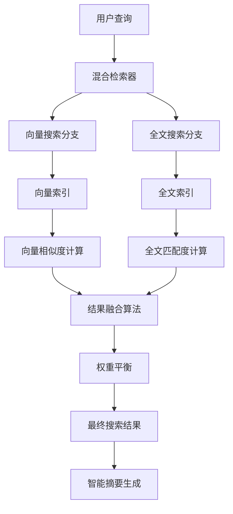

# ClickZetta 混合搜索系统

基于 ClickZetta 的企业级混合搜索系统，结合向量搜索和全文搜索的优势，提供精准且全面的文档检索体验。

## ✨ 功能特性

- 🔍 **混合搜索** - 向量搜索 + 全文搜索，精准度与召回率兼得
- ⚡ **多种搜索模式** - 支持纯向量、纯全文、混合搜索三种模式
- 🎛️ **权重可调** - 动态调整向量搜索与全文搜索的权重比例
- 🌏 **中文优化** - 支持 IK、标准、关键词三种中文分词器
- 📊 **实时统计** - 搜索性能监控和统计分析
- 🧠 **智能摘要** - 基于搜索结果生成智能摘要回答
- 📚 **搜索历史** - 完整的搜索记录和历史管理
- 🚀 **高性能** - ClickZetta 单表支持向量+全文双重索引

## 🎯 核心优势

### ClickZetta 混合搜索的独特之处

1. **单表双索引**: 在同一张表中同时支持向量索引和全文索引
2. **权重平衡**: 灵活调整向量搜索和全文搜索的权重比例
3. **性能优异**: 利用 ClickZetta 的高性能架构，实现毫秒级响应
4. **中文友好**: 专门针对中文场景优化的分词和检索

### 三种搜索模式对比

| 搜索模式 | 优势 | 适用场景 | 权重设置 |
|----------|------|----------|----------|
| **向量搜索** | 语义理解强，支持同义词 | 概念查询、相似内容查找 | α = 1.0 |
| **全文搜索** | 精确匹配，关键词定位准确 | 精确信息查找、关键词搜索 | α = 0.0 |
| **混合搜索** | 兼顾语义和精确匹配 | 综合查询，平衡精准度和召回率 | α = 0.7 (推荐) |

## 🚀 快速开始

### 1. 安装依赖

```bash
pip install -r requirements.txt
```

### 2. 配置环境变量

创建 `.env` 文件：

```bash
# ClickZetta 配置
CLICKZETTA_SERVICE=your-service
CLICKZETTA_INSTANCE=your-instance
CLICKZETTA_WORKSPACE=your-workspace
CLICKZETTA_SCHEMA=your-schema
CLICKZETTA_USERNAME=your-username
CLICKZETTA_PASSWORD=your-password
CLICKZETTA_VCLUSTER=your-vcluster

# DashScope 配置
DASHSCOPE_API_KEY=your-dashscope-key
```

### 3. 运行应用

```bash
streamlit run streamlit_app.py
```

## 📖 使用说明

### 基本使用流程

1. **系统配置**
   - 配置 ClickZetta 连接参数
   - 设置 DashScope API Key
   - 选择搜索模式和参数

2. **文档上传**
   - 上传 PDF 文档作为搜索库
   - 系统自动创建向量索引和全文索引

3. **混合搜索**
   - 输入自然语言查询
   - 系统同时执行向量搜索和全文搜索
   - 智能融合两种搜索结果

4. **结果分析**
   - 查看详细搜索结果
   - 生成智能摘要回答
   - 分析搜索性能统计

### 搜索配置详解

#### 搜索模式选择
- **hybrid**: 混合搜索，推荐日常使用
- **vector**: 纯向量搜索，适合语义查询
- **fulltext**: 纯全文搜索，适合精确匹配

#### 权重平衡 (α 参数)
- **0.0**: 100% 全文搜索
- **0.3**: 30% 向量 + 70% 全文
- **0.7**: 70% 向量 + 30% 全文 (推荐)
- **1.0**: 100% 向量搜索

#### 中文分词器
- **ik**: 智能分词，适合中文文档 (推荐)
- **standard**: 标准分词，通用性强
- **keyword**: 关键词分词，精确匹配

## 🏗️ 技术架构

### 混合搜索架构图



### 核心组件

```python
# 混合存储
hybrid_store = ClickZettaHybridStore(
    engine=engine,
    embeddings=embeddings,
    table_name="hybrid_search_vectors",
    text_analyzer="ik",  # 中文分词器
    distance_metric="cosine"
)

# 统一检索器
retriever = ClickZettaUnifiedRetriever(
    hybrid_store=hybrid_store,
    search_type="hybrid",  # 搜索模式
    alpha=0.7,  # 向量搜索权重
    k=5  # 返回结果数量
)

# 执行搜索
results = retriever.invoke("用户查询")
```

### 数据表结构

ClickZetta 混合搜索使用单表设计，同时支持向量和全文索引：

```sql
-- 混合搜索表结构
CREATE TABLE hybrid_search_vectors (
    id VARCHAR(255) PRIMARY KEY,
    content TEXT,
    embedding ARRAY<FLOAT>,  -- 向量列
    metadata TEXT,
    created_at TIMESTAMP
);

-- 向量索引
CREATE VECTOR INDEX embedding_idx ON hybrid_search_vectors(embedding)
PROPERTIES(
    "scalar.type" = "float",
    "distance.function" = "cosine_distance"
);

-- 全文索引
CREATE FULLTEXT INDEX content_idx ON hybrid_search_vectors(content)
PROPERTIES(
    "analyzer" = "ik"
);
```

## 🔍 搜索算法详解

### 混合搜索融合算法

ClickZetta 混合搜索使用加权融合算法：

```python
def hybrid_search(query: str, alpha: float = 0.7, k: int = 5):
    # 向量搜索
    vector_results = vector_search(query, k=k*2)
    vector_scores = normalize_scores(vector_results)

    # 全文搜索
    fulltext_results = fulltext_search(query, k=k*2)
    fulltext_scores = normalize_scores(fulltext_results)

    # 结果融合
    final_scores = {}
    for doc_id in set(vector_scores.keys()) | set(fulltext_scores.keys()):
        vector_score = vector_scores.get(doc_id, 0)
        fulltext_score = fulltext_scores.get(doc_id, 0)

        # 加权融合
        final_scores[doc_id] = alpha * vector_score + (1 - alpha) * fulltext_score

    # 排序并返回 top-k
    return sorted(final_scores.items(), key=lambda x: x[1], reverse=True)[:k]
```

### 分数归一化策略

不同搜索方式的分数范围不同，需要归一化处理：

- **向量搜索**: 余弦相似度 [0, 1]
- **全文搜索**: BM25 分数 [0, ∞)
- **归一化方法**: Min-Max 归一化到 [0, 1]

## 📊 性能优化

### 搜索性能调优

1. **索引优化**
   ```python
   # 选择合适的向量维度
   embeddings = DashScopeEmbeddings(model="text-embedding-v4")  # 1536维

   # 优化全文索引
   text_analyzer = "ik"  # 中文分词效果最佳
   ```

2. **参数调优**
   ```python
   # 平衡精度和性能
   k = 5  # 返回结果数量，过大影响性能
   alpha = 0.7  # 根据查询类型调整权重
   ```

3. **缓存策略**
   - 文档向量缓存
   - 查询结果缓存
   - 分词结果缓存

### 性能监控指标

- **搜索响应时间**: 目标 < 1s
- **索引构建时间**: 与文档大小成正比
- **内存使用**: 监控向量索引内存占用
- **准确率**: 通过用户反馈评估

## 🎯 应用场景

### 1. 企业知识库搜索
- **场景**: 内部文档、手册、FAQ 搜索
- **配置**: hybrid 模式，α=0.7，ik 分词器
- **优势**: 兼顾精确匹配和语义理解

### 2. 法律法规检索
- **场景**: 法条、案例、法律意见书搜索
- **配置**: hybrid 模式，α=0.3，keyword 分词器
- **优势**: 重视精确匹配，辅以语义搜索

### 3. 科研论文查找
- **场景**: 学术论文、技术文档搜索
- **配置**: vector 模式，α=1.0，标准分词器
- **优势**: 强化语义理解，发现相关概念

### 4. 客服知识库
- **场景**: 客服文档、产品说明书搜索
- **配置**: hybrid 模式，α=0.8，ik 分词器
- **优势**: 快速定位准确答案

## 📈 搜索效果评估

### 评估指标

1. **准确率 (Precision)**: 返回结果中相关文档的比例
2. **召回率 (Recall)**: 相关文档中被检索到的比例
3. **F1 分数**: 准确率和召回率的调和平均
4. **用户满意度**: 基于用户反馈的主观评估

### 参数调优建议

| 查询类型 | 推荐 α 值 | 分词器 | 说明 |
|----------|-----------|--------|------|
| 概念查询 | 0.8-1.0 | ik | 偏重语义理解 |
| 关键词查询 | 0.2-0.4 | keyword | 偏重精确匹配 |
| 混合查询 | 0.6-0.8 | ik | 平衡语义和精确 |
| 专业术语 | 0.3-0.5 | standard | 考虑专业性 |

## ❓ 常见问题

### Q: 如何选择最佳的 α 值？
A: 建议根据查询类型调整：
- 概念性查询: α ≥ 0.7 (偏向向量搜索)
- 精确查询: α ≤ 0.3 (偏向全文搜索)
- 一般查询: α = 0.7 (平衡模式)

### Q: 不同分词器有什么区别？
A:
- **ik**: 智能中文分词，效果最佳，推荐使用
- **standard**: 通用分词器，适合多语言文档
- **keyword**: 关键词分词，适合精确匹配场景

### Q: 搜索响应慢怎么办？
A: 可以尝试：
- 减少返回结果数量 (k值)
- 优化文档分块大小
- 使用更快的嵌入模型
- 检查网络连接状况

### Q: 如何提高搜索准确度？
A: 建议：
- 优化文档质量和结构
- 根据查询类型调整搜索模式
- 使用合适的分词器
- 收集用户反馈持续优化

## 📞 技术支持

### 社区支持
- GitHub Issues: [问题反馈](https://github.com/yunqiqiliang/langchain-clickzetta/issues)
- 社区讨论: [技术交流](https://github.com/yunqiqiliang/langchain-clickzetta/discussions)

### 企业支持
如需企业级技术支持和定制化服务，请联系云器科技团队。

---

🚀 **Powered by ClickZetta + DashScope + LangChain**

*让搜索更智能，让知识更易得*