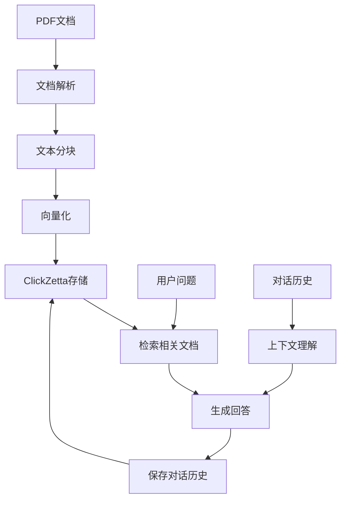

# ClickZetta 智能问答系统

基于 ClickZetta 向量存储的企业级智能问答系统，支持多轮对话、记忆功能和聊天历史管理。

## ✨ 功能特性

- 🤖 **智能问答** - 基于文档知识库的准确问答
- 🧠 **记忆功能** - 支持多轮对话上下文理解
- 💾 **聊天历史** - 持久化存储对话记录到 ClickZetta
- 🚀 **高性能检索** - ClickZetta 向量存储确保毫秒级响应
- 🌏 **中文优化** - DashScope 通义千问专门优化中文理解
- 📊 **实时统计** - 对话统计和系统状态监控
- 🔧 **企业级** - 连接池、会话管理、错误处理

## 🚀 快速开始

### 1. 安装依赖

```bash
pip install -r requirements.txt
```

### 2. 配置环境变量

创建 `.env` 文件：

```bash
# ClickZetta 配置
CLICKZETTA_SERVICE=your-service
CLICKZETTA_INSTANCE=your-instance
CLICKZETTA_WORKSPACE=your-workspace
CLICKZETTA_SCHEMA=your-schema
CLICKZETTA_USERNAME=your-username
CLICKZETTA_PASSWORD=your-password
CLICKZETTA_VCLUSTER=your-vcluster

# DashScope 配置
DASHSCOPE_API_KEY=your-dashscope-key
```

### 3. 运行应用

```bash
streamlit run streamlit_app.py
```

## 📖 使用说明

### 基本使用流程

1. **系统配置**
   - 配置 ClickZetta 连接参数
   - 设置 DashScope API Key
   - 选择嵌入模型和问答模型

2. **文档管理**
   - 上传 PDF 文档作为知识库
   - 系统自动处理文档并创建向量索引

3. **智能问答**
   - 在聊天界面输入问题
   - 系统基于知识库和对话历史生成回答
   - 支持多轮对话和上下文理解

4. **会话管理**
   - 新建会话开始全新对话
   - 清空历史删除当前会话记录
   - 导出对话历史为 JSON 文件

### 高级功能

#### 检索详情查看
- 点击"查看检索详情"查看相关文档片段
- 了解回答的依据和来源
- 支持文档元数据展示

#### 对话历史管理
- 所有对话自动保存到 ClickZetta
- 支持跨会话的历史查询
- 可导出完整对话记录

#### 实时统计面板
- 问题数量统计
- 回答数量统计
- 对话轮数统计
- 系统连接状态监控

## 🏗️ 技术架构

### 核心组件架构

```python
# ClickZetta 引擎
engine = ClickZettaEngine(
    service="your-service",
    instance="your-instance",
    # ... 连接配置
)

# 向量存储
vectorstore = ClickZettaVectorStore(
    engine=engine,
    embedding=DashScopeEmbeddings(),
    table_name="qa_knowledge_base"
)

# 聊天记忆
chat_memory = ClickZettaChatMessageHistory(
    engine=engine,
    session_id="unique_session_id",
    table_name="qa_chat_history"
)

# 问答链
qa_chain = RetrievalQA.from_chain_type(
    llm=Tongyi(),
    retriever=vectorstore.as_retriever(),
    memory=ConversationBufferWindowMemory(chat_memory=chat_memory)
)
```

### 数据流程



### 数据表结构

#### 知识库表 (qa_knowledge_base)
- `id`: 文档片段唯一标识
- `content`: 文档文本内容
- `embedding`: 文档向量
- `metadata`: 文档元数据

#### 聊天历史表 (qa_chat_history)
- `session_id`: 会话标识
- `message_id`: 消息标识
- `role`: 消息角色 (human/ai)
- `content`: 消息内容
- `timestamp`: 时间戳

## 🎯 与原版对比

| 特性 | 原版 (Pinecone) | ClickZetta 版本 |
|------|-----------------|------------------|
| 向量存储 | Pinecone (外部服务) | ClickZetta (企业内部) |
| 数据安全 | 数据上传外部 | 数据完全内部 |
| 对话记忆 | 无 | 持久化聊天历史 |
| 多轮对话 | 不支持 | 完整支持 |
| 中文优化 | 基础 | DashScope 专门优化 |
| 成本控制 | 按查询收费 | 企业内部控制 |
| 扩展性 | 依赖外部服务 | 企业级扩展 |
| 会话管理 | 内存临时 | 数据库持久化 |

## 🔧 配置选项

### DashScope 模型配置

#### 嵌入模型
- `text-embedding-v4`: 最新版本，效果最佳
- `text-embedding-v3`: 稳定版本，性能均衡

#### 问答模型
- `qwen-plus`: 平衡性能和效果，推荐使用
- `qwen-turbo`: 快速响应，适合高并发
- `qwen-max`: 最佳效果，适合复杂问答

### 问答参数配置

#### 检索设置
- **检索数量 (k)**: 1-10，控制检索的相关文档数量
- **创造性 (temperature)**: 0.0-1.0，控制回答的创造性
- **记忆窗口**: 3-20，保持的对话轮数

#### 高级配置
```python
# 自定义检索参数
retriever = vectorstore.as_retriever(
    search_type="similarity",
    search_kwargs={
        "k": 5,
        "score_threshold": 0.7  # 相似度阈值
    }
)

# 自定义记忆配置
memory = ConversationBufferWindowMemory(
    chat_memory=chat_history,
    k=10,  # 记忆窗口大小
    return_messages=True
)
```

## 📊 性能优化

### 检索优化
- 合理设置检索数量，平衡准确性和速度
- 使用相似度阈值过滤低质量匹配
- 定期清理和更新知识库

### 内存管理
- 调整记忆窗口大小，避免上下文过长
- 定期清理历史会话，控制存储大小
- 使用会话管理避免内存泄漏

### 连接优化
```python
# 连接池配置
engine = ClickZettaEngine(
    # ... 基础配置
    connection_timeout=60,
    query_timeout=1800,
    hints={
        "sdk.job.timeout": 3600,
        "query_tag": "qa_system"
    }
)
```

## 🔍 故障排除

### 常见问题

#### Q: 系统显示"ClickZetta 连接失败"
A: 检查以下配置：
- 网络连接是否正常
- ClickZetta 服务地址是否正确
- 用户名密码是否正确
- vcluster 参数是否匹配

#### Q: 问答质量不理想怎么办？
A: 可以尝试：
- 增加检索文档数量 (k值)
- 调整温度参数控制创造性
- 优化文档质量和结构
- 使用 qwen-max 模型提升效果

#### Q: 对话历史丢失了？
A: 检查：
- 会话ID是否正确
- ClickZetta 连接是否稳定
- 聊天历史表是否正常创建

#### Q: 文档上传处理失败？
A: 可能原因：
- PDF 文件损坏或格式不兼容
- 文件过大超出处理限制
- DashScope API 配额不足

### 性能监控

系统提供实时监控面板：
- 🟢 绿色: 系统正常运行
- 🔴 红色: 系统组件异常
- ⚠️ 黄色: 配置不完整

## 📞 技术支持

### 社区支持
- GitHub Issues: [问题反馈](https://github.com/yunqiqiliang/langchain-clickzetta/issues)
- 社区讨论: [技术交流](https://github.com/yunqiqiliang/langchain-clickzetta/discussions)

### 企业支持
如需企业级技术支持，请联系云器科技团队。

## 🎉 更新日志

### v1.0.0
- ✅ 基础问答功能
- ✅ ClickZetta 向量存储集成
- ✅ DashScope 模型支持
- ✅ 聊天历史持久化
- ✅ 多轮对话支持
- ✅ 实时统计面板

---

🚀 **Powered by ClickZetta + DashScope + LangChain**