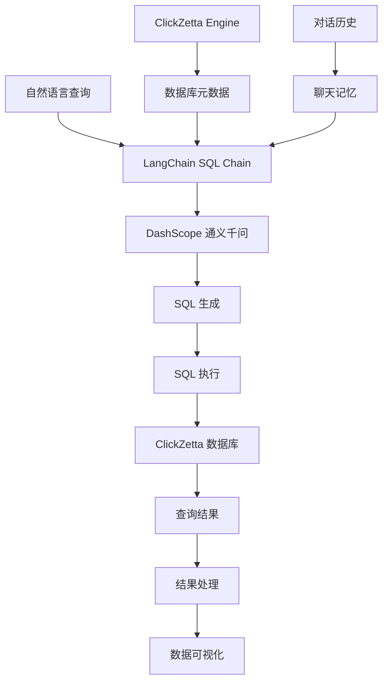

# ClickZetta SQL 智能问答

基于 ClickZetta 的 SQL 智能问答系统，支持自然语言转 SQL 查询，让数据分析变得像聊天一样简单。

## ✨ 功能特性

- 🧠 **自然语言转 SQL** - 用中文描述需求，自动生成 SQL 查询
- 💾 **智能数据库分析** - 自动获取表结构和元数据信息
- 💬 **对话式查询** - 支持上下文理解的多轮对话
- 📊 **结果可视化** - 自动展示查询结果为表格形式
- 📚 **查询历史** - 完整的查询记录和性能统计
- 🔍 **快速查询建议** - 预设常用查询模板
- 📥 **结果导出** - 支持 CSV 格式数据导出
- 🚀 **高性能** - 基于 ClickZetta 的高速数据处理

## 🎯 适用场景

### 1. 业务分析师
- **场景**: 日常数据分析、报表生成
- **优势**: 无需掌握复杂 SQL 语法
- **示例**: "查询本月销售额最高的前10个产品"

### 2. 产品经理
- **场景**: 用户行为分析、产品数据洞察
- **优势**: 快速获取业务指标
- **示例**: "统计每个功能模块的用户使用率"

### 3. 运营人员
- **场景**: 运营数据监控、效果评估
- **优势**: 实时查询运营指标
- **示例**: "找出最近一周活跃度下降的用户"

### 4. 数据科学家
- **场景**: 探索性数据分析、特征工程
- **优势**: 快速数据探索和验证
- **示例**: "分析用户年龄与购买偏好的关系"

## 🚀 快速开始

### 1. 安装依赖

```bash
pip install -r requirements.txt
```

### 2. 配置环境变量

创建 `.env` 文件：

```bash
# ClickZetta 配置
CLICKZETTA_SERVICE=your-service
CLICKZETTA_INSTANCE=your-instance
CLICKZETTA_WORKSPACE=your-workspace
CLICKZETTA_SCHEMA=your-schema
CLICKZETTA_USERNAME=your-username
CLICKZETTA_PASSWORD=your-password
CLICKZETTA_VCLUSTER=your-vcluster

# DashScope 配置
DASHSCOPE_API_KEY=your-dashscope-key
```

### 3. 运行应用

```bash
streamlit run streamlit_app.py
```

## 📖 使用说明

### 基本使用流程

1. **系统配置**
   - 配置 ClickZetta 数据库连接
   - 设置 DashScope API Key
   - 选择目标数据库模式

2. **数据库探索**
   - 系统自动加载表结构信息
   - 查看数据库概览和表列表
   - 了解可用数据资源

3. **自然语言查询**
   - 用中文描述查询需求
   - 系统自动生成 SQL 语句
   - 展示查询结果和数据

4. **结果分析**
   - 查看结构化数据表格
   - 导出查询结果为 CSV
   - 分析查询性能统计

### 查询示例

#### 基础查询
```
自然语言: "显示所有用户表"
生成SQL: SHOW TABLES LIKE '%user%'

自然语言: "查询订单表的前10条记录"
生成SQL: SELECT * FROM orders LIMIT 10
```

#### 统计分析
```
自然语言: "统计每个月的订单数量"
生成SQL: SELECT DATE_FORMAT(order_date, '%Y-%m') as month, COUNT(*) as order_count
         FROM orders GROUP BY month ORDER BY month

自然语言: "找出销售额最高的前5个产品"
生成SQL: SELECT product_name, SUM(amount) as total_sales
         FROM sales GROUP BY product_name ORDER BY total_sales DESC LIMIT 5
```

#### 条件筛选
```
自然语言: "查询最近30天的活跃用户"
生成SQL: SELECT DISTINCT user_id FROM user_activity
         WHERE activity_date >= DATE_SUB(CURDATE(), INTERVAL 30 DAY)

自然语言: "找出购买金额超过1000元的订单"
生成SQL: SELECT * FROM orders WHERE total_amount > 1000 ORDER BY total_amount DESC
```

## 🏗️ 技术架构

### 核心组件架构



### 核心代码

```python
# SQL 链初始化
sql_chain = ClickZettaSQLChain.from_engine(
    engine=clickzetta_engine,
    llm=tongyi_llm,
    return_sql=True,  # 返回生成的 SQL
    top_k=100  # 最大结果行数
)

# 执行查询
response = sql_chain.invoke({
    "query": "查询销售额最高的前10个产品",
    "chat_history": conversation_memory.buffer
})

# 解析结果
sql_query = response["sql_query"]
answer = response["answer"]
```

### 数据流程

1. **用户输入** → 自然语言查询
2. **上下文构建** → 数据库元数据 + 对话历史
3. **SQL 生成** → DashScope 模型推理
4. **SQL 执行** → ClickZetta 数据库查询
5. **结果处理** → 数据格式化和可视化
6. **历史记录** → 查询记录保存

## 🎛️ 配置选项

### 数据库设置

- **目标模式**: 指定要查询的数据库模式
- **包含示例数据**: 在提示词中包含表的示例数据
- **最大结果行数**: 限制查询返回的最大行数

### SQL 生成设置

- **SQL 生成创造性**: 控制 SQL 生成的创造性 (建议 ≤ 0.2)
- **返回 SQL 语句**: 是否在回答中显示生成的 SQL
- **启用对话记忆**: 记住对话历史，支持上下文查询

### 高级配置

```python
# 自定义 SQL 链配置
sql_chain = ClickZettaSQLChain.from_engine(
    engine=engine,
    llm=llm,
    prompt=custom_sql_prompt,  # 自定义提示词模板
    return_sql=True,
    top_k=1000,
    return_direct=False  # 是否直接返回SQL结果
)

# 自定义提示词模板
custom_prompt = PromptTemplate(
    input_variables=["input", "table_info", "dialect"],
    template="""
    你是一个 ClickZetta 数据库专家。基于以下表信息生成准确的SQL查询：

    数据库信息：
    {table_info}

    用户查询：{input}

    请生成标准的 ClickZetta SQL 语句。
    """
)
```

## 📊 性能优化

### 查询优化建议

1. **表结构优化**
   ```sql
   -- 确保重要字段有索引
   CREATE INDEX idx_order_date ON orders(order_date);
   CREATE INDEX idx_user_id ON orders(user_id);
   ```

2. **查询限制**
   ```python
   # 设置合理的结果行数限制
   max_result_rows = 1000  # 避免返回过多数据
   ```

3. **缓存策略**
   ```python
   # 缓存表结构信息
   @st.cache_data(ttl=3600)  # 缓存1小时
   def get_table_info(schema_name):
       return engine.get_table_info(schema=schema_name)
   ```

### 性能监控

- **查询响应时间**: 目标 < 3秒
- **SQL 生成时间**: 目标 < 2秒
- **数据传输效率**: 监控大结果集处理
- **成功率统计**: 跟踪查询成功率

## 🔍 查询技巧

### 查询语言技巧

1. **明确指定表名**
   ```
   ❌ "查询用户数据"
   ✅ "查询 users 表中的用户数据"
   ```

2. **具体化条件**
   ```
   ❌ "查询最近的订单"
   ✅ "查询最近7天的订单数据"
   ```

3. **明确聚合需求**
   ```
   ❌ "统计销售情况"
   ✅ "按月统计总销售额和订单数量"
   ```

### 上下文查询

利用对话记忆功能进行连续查询：

```
第1轮: "查询 2024年1月的订单数据"
第2轮: "统计这些订单的总金额"  # 自动关联上一轮结果
第3轮: "按产品类别分组显示"   # 继续基于前面的上下文
```

### 复杂查询拆解

对于复杂需求，可以分步查询：

```
复杂需求: "分析用户购买行为和产品关联性"

拆解为:
1. "查询用户购买记录表"
2. "统计每个用户的购买频次"
3. "分析产品共同购买模式"
```

## 📈 业务应用案例

### 电商数据分析

```python
# 销售分析查询示例
queries = [
    "查询本月销售额TOP10的产品",
    "统计不同年龄段用户的购买偏好",
    "分析商品退货率和原因分布",
    "找出复购率最高的用户群体"
]
```

### 用户行为分析

```python
# 用户分析查询示例
queries = [
    "统计每日活跃用户数量趋势",
    "分析用户留存率变化情况",
    "找出使用频率最高的功能模块",
    "识别流失风险较高的用户特征"
]
```

### 运营数据监控

```python
# 运营监控查询示例
queries = [
    "查询各渠道的转化率数据",
    "统计营销活动的效果评估",
    "分析不同时段的用户活跃度",
    "监控系统异常和错误日志"
]
```

## ❓ 常见问题

### Q: SQL 生成不准确怎么办？
A: 可以尝试：
- 更具体地描述查询需求
- 明确指定表名和字段名
- 检查数据库表结构是否正确
- 调整 SQL 生成的创造性参数

### Q: 查询执行失败的原因？
A: 常见原因包括：
- 表名或字段名不存在
- 权限不足无法访问某些表
- SQL 语法错误
- 数据类型不匹配

### Q: 如何提高查询效率？
A: 建议：
- 为常用查询字段创建索引
- 限制查询结果的行数
- 避免全表扫描操作
- 使用合适的查询条件

### Q: 对话记忆不工作？
A: 检查：
- 是否启用了对话记忆功能
- ClickZetta 连接是否正常
- 聊天历史表是否创建成功

## 📞 技术支持

### 社区支持
- GitHub Issues: [问题反馈](https://github.com/yunqiqiliang/langchain-clickzetta/issues)
- 社区讨论: [技术交流](https://github.com/yunqiqiliang/langchain-clickzetta/discussions)

### 企业支持
如需企业级技术支持和定制化 SQL 分析解决方案，请联系云器科技团队。

## 🎉 更新日志

### v1.0.0
- ✅ 自然语言转 SQL 功能
- ✅ ClickZetta 数据库集成
- ✅ DashScope 模型支持
- ✅ 对话记忆和上下文理解
- ✅ 查询历史和性能统计
- ✅ 结果可视化和导出
- ✅ 快速查询建议

---

🚀 **Powered by ClickZetta + DashScope + LangChain**

*让数据查询像聊天一样简单*